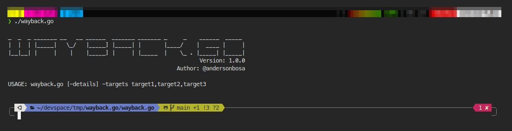
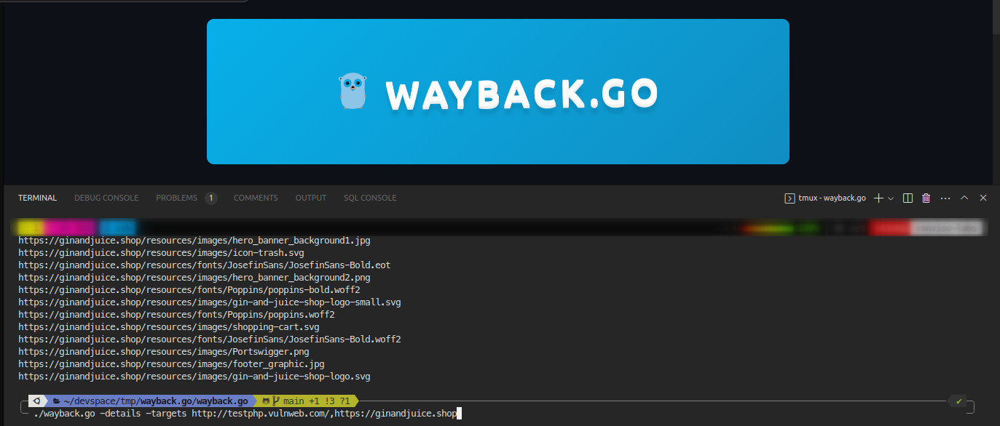

<section align="center">

  

  <br>
  <br>

  <!-- badges -->

  <p>
    <a href="#about">About</a> •
    <a href="#technologies">Technologies</a> •
    <a href="#contribution">Contribution</a> •
    <a href="#license">License</a>
  </p>
</section>

---

<h2 id="about">💬 About</h2>

> Project done with educational purpose.
> 
This tool in Golang provides an easy and efficient way to search the Wayback Machine across multiple targets. The tool uses the Wayback Machine API to retrieve archived versions of web pages, and then searches those archived versions using a user-provided search query.

The tool can be used for a variety of purposes, including research, development, and digital preservation. For example, researchers can use the tool to track the evolution of a topic across multiple websites, while developers can use the tool to debug issues or track changes on competitor websites.

<br/>

| Options                                   | Usage                                     |
| ----------------------------------------- | ----------------------------------------- |
|  |  |

### Video Tutorial

[](https://asciinema.org/a/606525)

Steps:

```bash
# [optional] i will enter in a docker container to tutorials purposes
docker run --rm -it alpine:latest sh 

# downloading the application
wget https://github.com/andersonbosa/wayback.go/raw/main/wayback.go/wayback.go

# permissions
chmod +x 

# usage
./wayback.go -details -targets http://testphp.vulnweb.com/,https://ginandjuice.shop
```

<h2 id="technologies"> 🛠️ Technologies</h2>

* [Golang](https://golang.org/)
* [Wayback Machine](http://wayback.archive.org/)


<h2 id="contribution">🤝 Contribution</h2>

<p>
  This project is for study purposes too, so please send me a message telling me what you are doing and why you are doing it, teach me what you know. All kinds of contributions are very welcome and appreciated!
</p>


<h2 id="license"> 📝 License</h2>

This project is under the [CC0-1.0 license](LICENSE.md).

---

<h4>  
  
  | Did you like the repository? Give it a star! 😁
</h4>


<!-- Links -->
